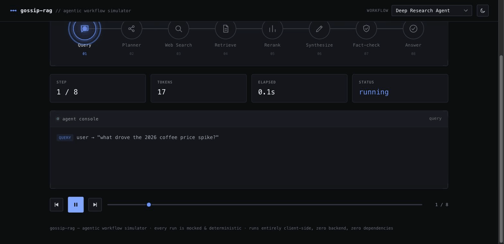

# gossip-rag

**An agentic-AI workflow simulator — watch real-shaped agent pipelines execute, step by step.**

Pick a workflow (deep research, RAG Q&A, multi-agent code review, support triage)
and press play. A pipeline of icon stages lights up in sequence, a data packet
rides the rail between them, an agent console streams the run, and the token /
latency meters tick up — so a fully **mocked** run reads like watching a real,
sophisticated agent work.



## It's all mocked — that's the point

There are **no live model or tool calls anywhere**. Every workflow is a
deterministic, hand-authored timeline (`ui/workflows.js`) written to read like a
genuine execution trace — realistic tool results, streamed generations,
token counts and latencies. The value is the *simulation*: a clean, legible way
to see how an agent pipeline actually unfolds, that runs instantly, for free,
offline, and identically every time. Nothing to configure, no API keys, no cost.

## The workflows

| Workflow | What it shows |
|---|---|
| **Deep Research Agent** | query → planner → web search → retrieve → rerank → synthesize → fact-check → answer |
| **RAG Q&A Pipeline** | embed → vector search → rerank → context assembly → grounded generation |
| **Multi-Agent Code Review** | an orchestrator fans a PR diff out to security / performance / style agents, then aggregates a verdict |
| **Support Ticket Triage** | classify → retrieve policy → draft reply → guardrail check → route |

## How it's built

- **Pure front-end, zero dependencies, zero build step.** Vanilla HTML / CSS /
  JS — no framework, no bundler, no canvas. The pipeline is DOM + CSS so the
  icons stay crisp and the motion stays smooth; the moving packet, stage glow,
  streaming typewriter, and count-up meters are all hand-rolled.
- **Transport controls** — play / pause (with a proper icon toggle), step
  forward / back, and a scrubber; keyboard `space` / `←` / `→` / `t`.
- **Light + dark themes**, following `prefers-color-scheme` with a manual toggle.
- Design language shared with the companion portfolio site: calm, instrument-panel
  aesthetic — JetBrains Mono chrome, one blue accent, thin hairlines, corner-bracket
  "scan target" framing.

## Run it

**Live:** https://gossip-rag.pulsar-projects.org

Locally, it's just static files:

```bash
git clone https://github.com/Chitransh-Saxena/gossip-rag
cd gossip-rag
python3 -m http.server 8000   # then open http://localhost:8000/ui/
```

## Add a workflow

Adding one is purely declarative — append an object to `WORKFLOWS` in
`ui/workflows.js` with a list of `stages` (each with an `icon` + `label`) and a
`steps` timeline (each step names its stage and carries a console `log`, mock
`tokens`/`ms`, and an optional `stream` for a typed-out generation). The player
picks it up automatically.

## License

MIT — see [LICENSE](LICENSE).
