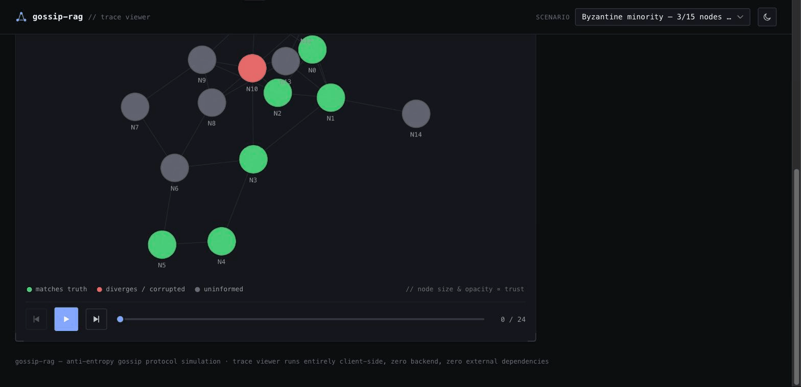

# gossip-rag

**How truth survives — or doesn't — in a decentralized multi-agent RAG network.**

A peer-to-peer network of agents gossips retrieved facts to each other using
an anti-entropy protocol (the same class of algorithm behind Cassandra/Dynamo-
style eventual consistency), with trust-weighted reconciliation to resolve
disagreement. Some nodes are seeded with corrupted or stale claims. Watch
whether — and how — the network heals.



*Blips on the ring are agents (green = agrees with the truth · red = holds the corrupted claim · grey = uninformed); the core is a live consensus gauge. Only exchanges that actually change a belief are animated — a colour-coded packet rides the chord and the receiving blip flips the instant it lands; the many "we already agree" corroborations stay silent.*

## The problem

Agent-to-agent protocols went from proposal to production fast: Google's A2A
hit v1.0 in April 2026 with 150+ organizations behind it, alongside MCP, both
now under the Linux Foundation. But a wave of very recent research is
flagging what those protocols *don't* cover — a 2026 survey on interoperability
protocols is literally titled ["Governance Gaps in Agent Interoperability
Protocols: What MCP, A2A, and ACP Cannot Express"](https://arxiv.org/pdf/2606.31498).
Separately, RAG-specific trust and provenance work has picked up this year —
["RAGShield: Detecting Numerical Claim Manipulation in Government RAG
Systems"](https://arxiv.org/abs/2604.00387) looks at defending a knowledge base
against manipulated claims, and a 2026 survey on ["From Agent Traces to Trust:
Evidence Tracing and Execution Provenance in LLM
Agents"](https://arxiv.org/abs/2606.04990) maps out claim-support graphs as a
representation for *why* an agent's answer should be trusted.

Meanwhile, the observability tools that already exist for agents — LangSmith,
Langfuse, Arize Phoenix, and similar — are built around tracing calls and
cost *within* a single agent framework. None of them model the agent-to-agent
handoff itself as a trust-bearing event, which is exactly the layer the
governance-gaps research says is unaddressed.

This repo doesn't claim to solve that. It's a small, runnable, honestly-scoped
reference implementation of one piece of it: what does trust-weighted
consensus over gossiped, RAG-derived claims actually look like, including
where it *doesn't* fully work?

## How it works

```
   ┌────────────┐        anti-entropy gossip        ┌────────────┐
   │  Node A    │◄──────────────────────────────────►│  Node B    │
   │ belief:    │   push-pull: each round, every     │ belief:    │
   │  value     │   active node initiates one         │  value     │
   │  confidence│   exchange with a random graph      │  confidence│
   │  trust     │   neighbor — BOTH sides reconcile   │  trust     │
   │  provenance│   against the pre-exchange state    │  provenance│
   └────────────┘                                     └────────────┘
         │                                                   │
         └──────────────────  conflict?  ────────────────────┘
                                  │
                    incoming score = confidence × trust
                    receiver score = confidence × trust
                                  │
                 higher score wins → receiver adopts it
             (the convert's own trust is untouched — updating
              toward better evidence isn't a strike against you)
                                  │
                 lower score loses → its PUSHER's trust drops
           (only *spreading a claim that gets rejected* costs trust —
            see trust.py's module docstring for why push-only gossip,
            and a hard "force below X trust" rule, both turned out to
            make corrupted nodes *harder* to reliably correct, not easier)
```

Each node's local "RAG" is a handful of mock documents with a pre-baked
extracted claim standing in for what an LLM call would have produced (see
[Why no real LLM calls](#why-no-real-llm-calls) below). Two scenarios ship
with this repo:

| Scenario | What it shows |
|---|---|
| `byzantine-minority` | 15 nodes, 3 seeded with a false claim from round 0, 2 more offline until round 8. An honest majority + trust-weighted gossip fully corrects the network by round ~8 and stays stable. |
| `partition-heal` | 10 nodes split into two islands with no path between them. Island A has real sources and converges to the truth alone. Island B has *no* real sources — only a single byzantine seed — so it fully echo-chambers onto the false claim (correctly: there's no honest signal reachable inside its own island for trust-weighting to lean on). At round 12 the islands reconnect, and Island A's belief propagates in and corrects Island B by round ~13. |

## Quickstart

```bash
git clone <this repo>
cd gossip-rag
python3 -m venv .venv && source .venv/bin/activate
pip install -e ".[dev]"

python -m gossiprag run --all      # writes traces/*.trace.json + manifest.json
open ui/index.html                  # or: cd ui && python3 -m http.server
```

The UI is a static, dependency-free page — no build step, no server required
beyond serving static files (some browsers block `fetch()` on `file://` URLs,
hence `python3 -m http.server` as the reliable option). It reads whichever
trace files exist in `traces/` and never talks to Python at runtime.

```bash
pytest              # 15 tests: topology properties, trust reconciliation
                     # rules, and the two scenarios' convergence guarantees
```

## Why no real LLM calls

Every "extraction" in this repo is a pre-baked value sitting on a
`Document` fixture (see `src/gossiprag/fixtures/`), read through
`mock_llm.MockExtractor`. That's a deliberate interface boundary, not a
shortcut:

```python
class FactExtractor(Protocol):
    def extract(self, document: Document, question: str) -> ExtractedClaim: ...
```

The gossip protocol, trust reconciliation, and UI don't know or care whether
`extract()` was answered by a dictionary lookup or a real completion call.
Swap `MockExtractor` for something that actually prompts a model and nothing
downstream changes. Keeping it mocked means this repo runs instantly, for
free, offline, deterministically (seeded), and the interesting part — the
protocol — isn't drowned out by API latency or cost.

## Architecture

```
src/gossiprag/
  models.py       # Node, Belief, Claim, Document, Trace — the data model
  topology.py     # small-world graph generator + cross-group bridging
  trust.py        # the reconciliation rule — see its module docstring for
                   # two design mistakes an earlier version made and why
  protocol.py      # the round loop: who gossips with whom, in what order
  mock_llm.py       # the one interface seam where a real model call would go
  scenarios.py       # the two scenarios, as plain data-building functions
  fixtures/            # the mock corpus (a fictional FPV drone race — see
                       # its module docstring for why)
  simulate.py           # CLI: run a scenario, write traces/<id>.trace.json
ui/                       # static HTML/JS/Canvas trace viewer, zero deps
traces/                    # generated trace files + manifest.json
tests/                      # pytest — topology, trust rules, convergence
TRACE_SCHEMA.md              # the JSON contract between the engine and the UI
```

Adding a third scenario is just a third function in `scenarios.py` plus a
line in the `SCENARIOS` dict — `simulate.py run --all` picks it up and
regenerates the manifest automatically.

## Related work

- [Governance Gaps in Agent Interoperability Protocols: What MCP, A2A, and ACP Cannot Express](https://arxiv.org/abs/2606.31498)
- [RAGShield: Detecting Numerical Claim Manipulation in Government RAG Systems](https://arxiv.org/abs/2604.00387)
- [From Agent Traces to Trust: A Survey of Evidence Tracing and Execution Provenance in LLM Agents](https://arxiv.org/abs/2606.04990)
- [MedTrust-RAG: Evidence Verification and Trust Alignment for Biomedical Question Answering](https://arxiv.org/abs/2510.14400)

## License

MIT — see [LICENSE](LICENSE).
